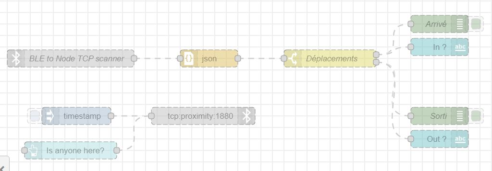
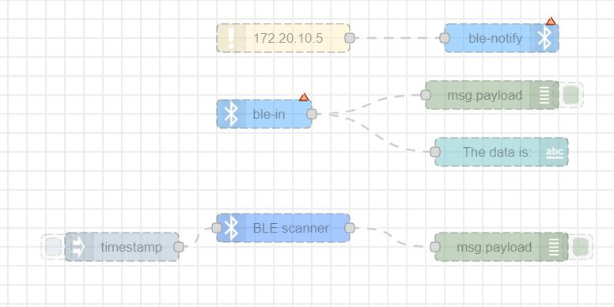
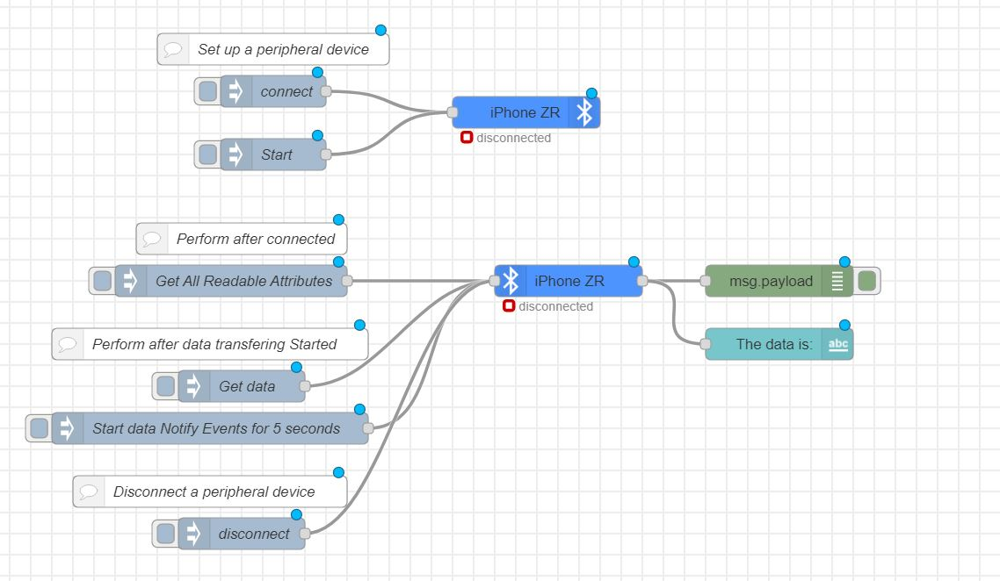
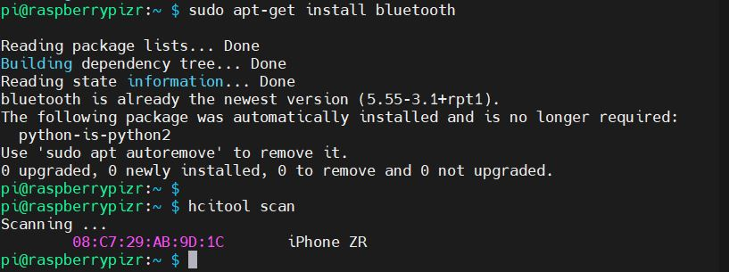
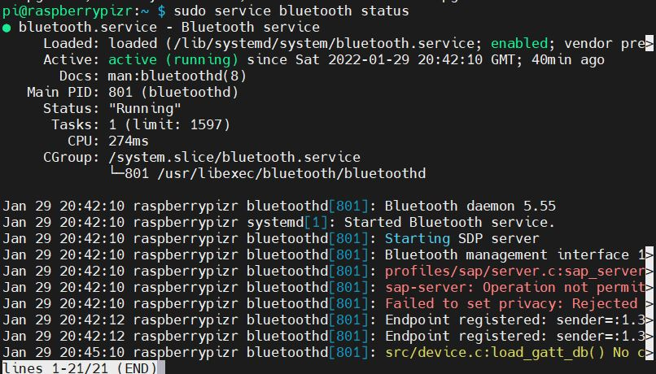

# Projet 5
## Création d'un micro OS pour Raspberry pi3 avec Buildroot :
Afin d'émuler un Raspberry Pi sur votre PC , on installe un systéme d'exploitation Ubuntu Desktop l'ubuntu 20.04 ( la version la plus récente) soit sur le systéme directement soit sur la machine virtuelle.

Installer le qemu par la commande 
```sh
sudo apt-get install qemu-system-arm
```
Installer  des lib ainsi que les dépendances nécessaires par les commandes 
```sh
sudo apt-get install libncurses5-dev bc
sudo apt install build-essential
sudo apt-get install manpages-dev
```

Il est essentiel de faire l'update et l'upgrade du systeme avant d'installer le buildroot 
```sh
sudo apt-get upgrade
sudo apt-get update
```
Installer le git ..
```sh
sudo get install git
``` 
Téléchargerment de buildroot par la commande 
```sh
git clone https://github.com/buildroot/buildroot.git
``` 
Puis dans le dossier board/ raspberrypi /raspberry pi 3  l'image doit être générée par la commande
```sh
cat genimage-raspberrypi3.cfg
``` 
Installation des packages appropriés , nécessaires et souhaités pour l'OS
```sh
make raspberry3_defconfig
``` 
Il est primordiale d'activer le ssh 
 >`--Target packages` -->`--Network applications`-->`--open ssh`  

La configuration de l'internet est aussi nécessaire , on suit la méthode et les instructions utilisés dans ce blog
https://blog.crysys.hu/2018/06/enabling-wifi-and-converting-the-raspberry-pi-into-a-wifi-ap/ 

Aprés toutes configurations faites, on crée l'image de notre système d'exploitation par la commande 
```sh
make -j8 
``` 
ou bien on la lance en arrière plan par la commande 
```sh
make -j8&
``` 

Une fois l'image est prête, on utlise RaspberryPi imager pour la télécharger dans la micro SD qui sera insérée dans la raspberry pi3.

## Transmettre la data par un application Bluetooth:
J'ai essayé plusieurs méthodes pour transmettre la date de mon iPhone au PC mais malgré que la connection était établie j'ai pas pu configuré le simulteur

### Essai 1 : 
J'ai activé le serial port par la commande 
```sh
raspi-config 
```
et j'ai utilisé les commandes suivantes pour installer le bluetooth

```sh
sudo apt-get install pi-bluetooth 
sudo service bluetooth status'
```


### Essai 2: 
J'ai pensé à utiliser Cedela et Flutter mais cette méthode n'inclue pas la partie BLE!

### Essai 3: 
J'ai utilisé  les nodes suivantes



### Essai 4 :
J'ai utilisé les nodes Generic BLE configuration  en suivant le tuto suivant
 >`https://flows.nodered.org/node/node-red-contrib-generic-ble`
 
 
 
Mais j'ai pas réussi à configurer le simulateur BLE sur mon iphone , j'ai essayé plusieurs : DataWorks, BlueTemp, Bluetooth inspector , CZBLEcontrol ...
 >`https://forums.raspberrypi.com/viewtopic.php?t=138145&f=28`
 
 Malgré que l'adresse est détectée et le bluetooth qui fonctionne bien, mon iPhone n'envoie rien!!
 
 
 
 


## Quelques commandes utiles pour l'activation et la mise en place de mode de communication par bluetooth :
```sh
sudo apt-get install bluetooth python3-yaml python3-bluetooth
sudo nano rpi-home-automation/ble2tcp/devices.yml
```
Ajouter l'addresse Mac de PC ( écrire ipconfig /all dans le cmd du PC) et de raspberry dans le script 
```sh
sudo apt-get install bluetooth
```
```sh
sudo hciconfig hci0 leadv 
```
pour que la carte soit visible dans la recherche de l'application (activation de l'advertisment)
```sh
sudo gatttool -b <adresse MAC> -I
```

